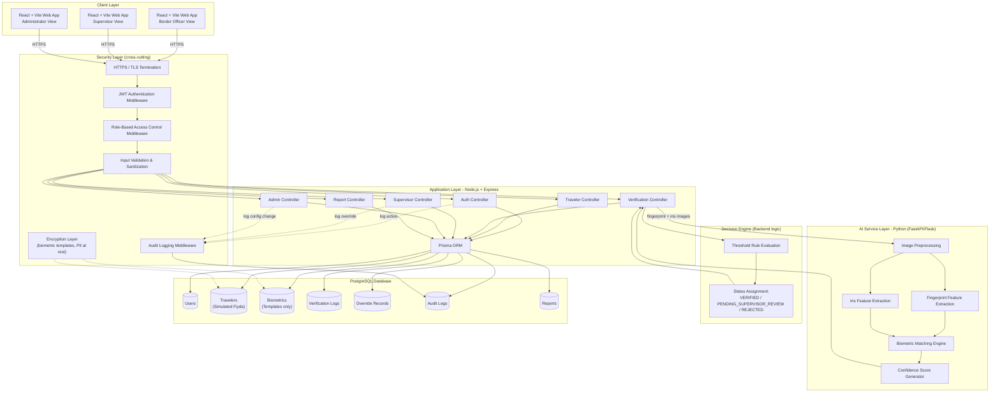
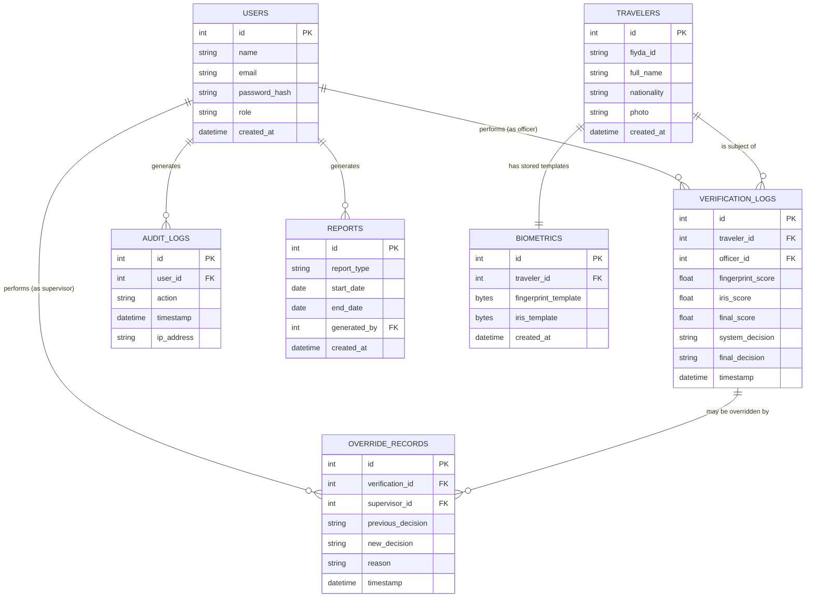
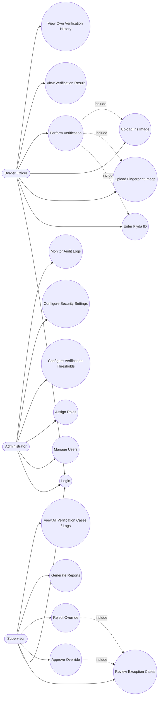
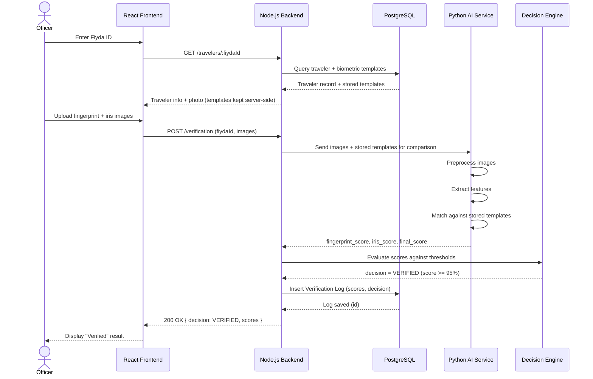
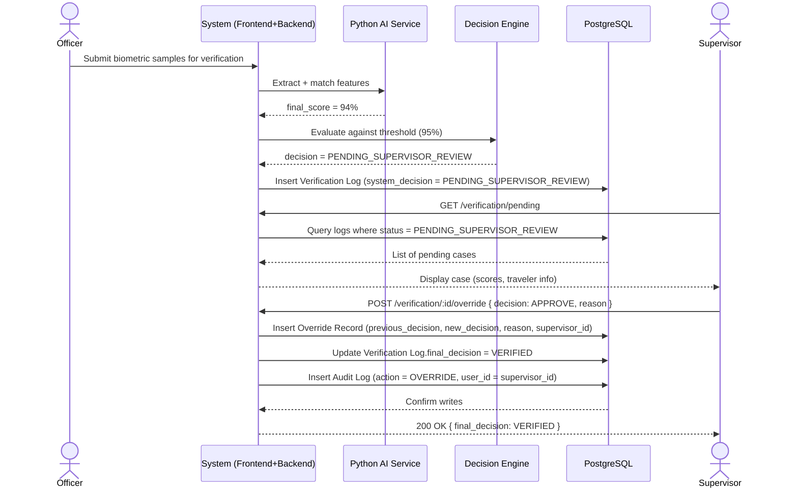
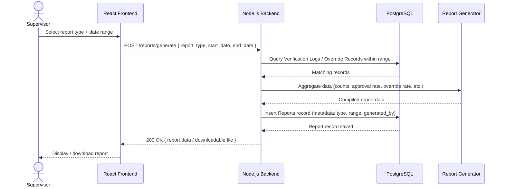

# Intelligent Automated Border Control System Using AI-Based Fingerprint and Iris Recognition

## System Design Documentation

**Document Type:** Pre-Implementation System Design
**Prepared For:** Internship / Cybersecurity Review
**Scope:** Biometric verification (1:1) of travelers against a simulated Fiyda identity database. Enrollment, passport scanning, and facial recognition are explicitly out of scope.

---

## Table of Contents

1. System Architecture Diagram
2. Database ER Diagram
3. Use Case Diagram
4. Sequence Diagrams
5. API Documentation

---

# 1. System Architecture Diagram

## 1.1 Diagram



## 1.2 Component Explanations

### Frontend (React + Vite)
A single-page application serving three role-specific views: Border Officer, Supervisor, and Administrator. Vite is used purely as the build/dev tool; React handles routing, forms (Fiyda ID entry, biometric image upload), and result display. The frontend never talks to the database or AI service directly — it only calls the Node.js backend over HTTPS.

### Security Layer (cross-cutting)
Rather than being a single box, security is enforced at every request boundary:
- **HTTPS/TLS** terminates all client-backend traffic.
- **JWT Authentication** verifies the identity of the caller on every protected route.
- **RBAC Middleware** checks the authenticated user's role (Officer, Supervisor, Administrator) before allowing access to a controller.
- **Input Validation** sanitizes Fiyda IDs, file uploads, and query parameters before they reach business logic.
- **Audit Logging** records authentication events, verification attempts, supervisor overrides, and admin configuration changes.
- **Encryption Layer** protects biometric templates and traveler PII at rest in PostgreSQL, and ensures templates are never exposed in plaintext through the API.

### Backend (Node.js + Express)
The backend is the orchestrator of the entire workflow. It exposes REST endpoints for authentication, traveler lookup, verification, supervisor actions, administration, and reporting. It calls Prisma to read/write PostgreSQL, and calls the Python AI service (over HTTP, internal network only) to obtain biometric similarity scores. The **Decision Engine** described in the workflow is implemented as backend logic — it takes AI-returned scores and applies configurable thresholds to decide the verification outcome.

### AI Service (Python — FastAPI/Flask)
A stateless internal service responsible only for biometric computation:
- Preprocessing uploaded fingerprint/iris images (normalization, alignment).
- Extracting biometric features into templates.
- Comparing extracted features against the traveler's stored templates (retrieved by the backend and passed to the AI service, or fetched by the AI service via a controlled internal call).
- Returning fingerprint similarity score, iris similarity score, and an aggregated confidence score.

The AI service holds no direct connection to the frontend and is not internet-facing; it is only reachable from the Node.js backend.

### PostgreSQL Database (simulated Fiyda + system data)
Stores all persistent system data: users, simulated Fiyda traveler records, biometric templates, verification logs, override records, audit logs, and reports. Access is exclusively through Prisma ORM from the backend — nothing else is permitted to query the database directly.

### Border Officer / Supervisor / Administrator Workflows
- **Officer workflow:** login → enter Fiyda ID → system retrieves traveler + templates → officer uploads biometric samples → backend calls AI service → decision engine returns result → officer views result.
- **Supervisor workflow:** login → view pending/uncertain cases → review AI scores and traveler data → approve or reject override → override recorded in audit log → generate reports.
- **Administrator workflow:** login → manage users and role assignments → configure verification thresholds and security settings → monitor audit logs.

---

# 2. Database ER Diagram

## 2.1 Diagram



## 2.2 Relationship Summary (Cardinalities)

| Relationship | Cardinality | Meaning |
|---|---|---|
| Users → Verification Logs | 1 : N | One officer performs many verifications |
| Users → Override Records | 1 : N | One supervisor performs many overrides |
| Users → Audit Logs | 1 : N | One user generates many audit entries |
| Users → Reports | 1 : N | One user (supervisor/admin) generates many reports |
| Travelers → Biometrics | 1 : 1 | Each simulated Fiyda traveler has exactly one biometric template record |
| Travelers → Verification Logs | 1 : N | One traveler may be verified multiple times (repeat crossings) |
| Verification Logs → Override Records | 1 : 0..1 | A verification log is overridden at most once (a rejected override could theoretically be re-reviewed, but the base design assumes a single override entry per case; multiple attempts can be modeled as multiple rows referencing the same verification_id if needed) |

## 2.3 Why Each Table Exists

- **Users** — Represents the three system roles (Officer, Supervisor, Administrator). Required for authentication, authorization, and attributing every action (verification, override, audit entry, report) to a specific accountable person.
- **Travelers** — Represents the simulated Fiyda identity record. This is deliberately separate from the raw dataset; it is the "system of record" the backend queries when an officer enters a Fiyda ID. It intentionally excludes biometric templates so that identity data and biometric data can be protected/encrypted independently.
- **Biometrics** — Stores only *extracted templates*, never raw fingerprint/iris images, as the authoritative reference data used for matching. Separating this table from Travelers allows stricter encryption and access control specifically on biometric data, consistent with data-protection best practice for sensitive biometric information.
- **Verification Logs** — The core transactional record of the system: every verification attempt, whether verified, rejected, or sent to review, with the exact scores produced by the AI service. This supports traceability, dispute resolution, and reporting.
- **Override Records** — Captures supervisor exception handling as a first-class, immutable audit trail: what the system originally decided, what the supervisor changed it to, why, and when. This is required both operationally and for cybersecurity accountability.
- **Audit Logs** — A general-purpose security log capturing sensitive actions (logins, overrides, admin configuration changes) independent of business logs, so security monitoring does not depend on interpreting verification data.
- **Reports** — Stores metadata about generated reports (type, date range, who generated it) so supervisors/administrators have a historical record of reporting activity, separate from the underlying data the reports summarize.

---

# 3. Use Case Diagram

## 3.1 Diagram



## 3.2 Actor Descriptions

**Border Officer** — Front-line user. Can log in, look up a traveler by Fiyda ID, upload biometric samples on the traveler's behalf, trigger verification, and view results and their own history. Cannot change or override a decision — this restriction is enforced by RBAC at the API layer, not just hidden in the UI.

**Supervisor** — Oversight role. Can see every verification case (not just their own), specifically review cases flagged `PENDING_SUPERVISOR_REVIEW`, approve or reject overrides with a mandatory reason, and generate reports.

**Administrator** — System governance role. Manages user accounts and role assignments, configures system-wide settings including the verification acceptance threshold and review-range boundaries, manages security configuration, and monitors the audit log for anomalous activity. The Administrator does not perform verifications or overrides — those are operational actions reserved for Officer/Supervisor roles.

## 3.3 Include Relationships

- **Perform Verification** includes Enter Fiyda ID, Upload Fingerprint, and Upload Iris — a verification cannot be started without all three.
- **Approve Override** and **Reject Override** both include Review Exception Cases — a supervisor must open and review a case before acting on it.

---

# 4. Sequence Diagrams

## 4.1 Successful Verification



## 4.2 Failed Verification (Low Confidence → Rejected)

```mermaid
sequenceDiagram
    actor Officer
    participant FE as React Frontend
    participant BE as Node.js Backend
    participant AI as Python AI Service
    participant DE as Decision Engine
    participant DB as PostgreSQL

    Officer->>FE: Upload fingerprint + iris images
    FE->>BE: POST /verification (fiydaId, images)
    BE->>AI: Send images + stored templates
    AI-->>BE: fingerprint_score, iris_score, final_score (e.g. 61%)

    BE->>DE: Evaluate scores against thresholds
    DE-->>BE: decision = REJECTED (below review range)

    BE->>DB: Insert Verification Log (scores, decision = REJECTED)
    DB-->>BE: Log saved

    BE-->>FE: 200 OK { decision: REJECTED }
    FE-->>Officer: Display "Verification Rejected"
    Note over BE,DB: Rejection is logged like every other outcome;<br/>no automatic retry or override is possible for the Officer.
```

## 4.3 Supervisor Override Case



## 4.4 Report Generation



---

# 5. API Documentation

All endpoints (except login) require a valid JWT in the `Authorization: Bearer <token>` header and are enforced by role via RBAC middleware. All traffic is served over HTTPS. All request bodies are validated server-side before processing.

## 5.1 Authentication API

### POST /auth/login
- **Purpose:** Authenticate a user (Officer, Supervisor, or Administrator) and issue a JWT.
- **Authentication required:** No
- **Required role:** None (public endpoint)
- **Request body:**
```json
{
  "email": "officer1@borderpost.gov.et",
  "password": "string"
}
```
- **Response (200):**
```json
{
  "token": "jwt-token-string",
  "user": {
    "id": 12,
    "name": "Officer Name",
    "role": "OFFICER"
  }
}
```
- **Response (401):** `{ "error": "Invalid credentials" }`

## 5.2 Traveler API

### GET /travelers/:fiydaId
- **Purpose:** Retrieve a traveler's simulated Fiyda record (identity info, photo, and a reference to stored biometric templates) prior to verification.
- **Authentication required:** Yes
- **Required role:** Officer, Supervisor, Administrator
- **Request body:** None (fiydaId as URL path parameter)
- **Response (200):**
```json
{
  "traveler": {
    "id": 5,
    "fiyda_id": "FYD-0001234",
    "full_name": "Jane Doe",
    "nationality": "Ethiopia",
    "photo": "base64-or-url"
  },
  "biometrics_available": true
}
```
- **Response (404):** `{ "error": "Traveler not found in Fiyda system" }`

## 5.3 Verification API

### POST /verification
- **Purpose:** Submit uploaded fingerprint and iris images for a given traveler, trigger AI matching, apply decision-engine thresholds, and record the result.
- **Authentication required:** Yes
- **Required role:** Officer
- **Request body:** `multipart/form-data`
```
fiyda_id: string
fingerprint_image: file
iris_image: file
```
- **Response (200):**
```json
{
  "verification_id": 88,
  "fingerprint_score": 0.97,
  "iris_score": 0.95,
  "final_score": 0.96,
  "system_decision": "VERIFIED"
}
```
- **Possible system_decision values:** `VERIFIED`, `PENDING_SUPERVISOR_REVIEW`, `REJECTED`
- **Response (400):** `{ "error": "Missing or invalid biometric image" }`

## 5.4 Supervisor APIs

### GET /verification/pending
- **Purpose:** Retrieve all verification cases currently awaiting supervisor review.
- **Authentication required:** Yes
- **Required role:** Supervisor
- **Request body:** None (optional query params: `page`, `limit`)
- **Response (200):**
```json
{
  "pending_cases": [
    {
      "verification_id": 88,
      "traveler_fiyda_id": "FYD-0001234",
      "final_score": 0.94,
      "system_decision": "PENDING_SUPERVISOR_REVIEW",
      "timestamp": "2026-07-15T09:12:00Z"
    }
  ]
}
```

### POST /verification/:id/override
- **Purpose:** Record a supervisor's decision on a pending or disputed verification case, overriding the system's automated decision.
- **Authentication required:** Yes
- **Required role:** Supervisor
- **Request body:**
```json
{
  "new_decision": "VERIFIED",
  "reason": "Manual review confirmed match; minor sensor artifact caused low score."
}
```
- **Response (200):**
```json
{
  "override_id": 14,
  "verification_id": 88,
  "previous_decision": "PENDING_SUPERVISOR_REVIEW",
  "new_decision": "VERIFIED",
  "supervisor_id": 3,
  "timestamp": "2026-07-15T09:20:00Z"
}
```
- **Response (403):** `{ "error": "Insufficient permissions" }`

## 5.5 Report APIs

### GET /reports
- **Purpose:** List previously generated reports.
- **Authentication required:** Yes
- **Required role:** Supervisor, Administrator
- **Request body:** None (optional query params: `report_type`, `start_date`, `end_date`)
- **Response (200):**
```json
{
  "reports": [
    {
      "id": 4,
      "report_type": "VERIFICATION_SUMMARY",
      "start_date": "2026-07-01",
      "end_date": "2026-07-15",
      "generated_by": 3,
      "created_at": "2026-07-15T10:00:00Z"
    }
  ]
}
```

### POST /reports/generate
- **Purpose:** Generate a new report aggregating verification/override activity over a given date range.
- **Authentication required:** Yes
- **Required role:** Supervisor, Administrator
- **Request body:**
```json
{
  "report_type": "VERIFICATION_SUMMARY",
  "start_date": "2026-07-01",
  "end_date": "2026-07-15"
}
```
- **Response (201):**
```json
{
  "report_id": 5,
  "report_type": "VERIFICATION_SUMMARY",
  "summary": {
    "total_verifications": 320,
    "auto_verified": 290,
    "rejected": 20,
    "overridden": 10
  }
}
```

## 5.6 Audit API

### GET /audit-logs
- **Purpose:** Retrieve system audit logs for security monitoring.
- **Authentication required:** Yes
- **Required role:** Administrator
- **Request body:** None (optional query params: `user_id`, `action`, `start_date`, `end_date`)
- **Response (200):**
```json
{
  "audit_logs": [
    {
      "id": 201,
      "user_id": 3,
      "action": "OVERRIDE_APPROVED",
      "timestamp": "2026-07-15T09:20:00Z",
      "ip_address": "10.0.4.22"
    }
  ]
}
```

## 5.7 Role-to-Endpoint Access Matrix

| Endpoint | Officer | Supervisor | Administrator |
|---|:---:|:---:|:---:|
| POST /auth/login | Yes | Yes | Yes |
| GET /travelers/:fiydaId | Yes | Yes | Yes |
| POST /verification | Yes | No | No |
| GET /verification/pending | No | Yes | No |
| POST /verification/:id/override | No | Yes | No |
| GET /reports | No | Yes | Yes |
| POST /reports/generate | No | Yes | Yes |
| GET /audit-logs | No | No | Yes |

---

# Appendix: Notes for Implementation Team

- All mermaid diagrams above render directly in GitHub, most Markdown viewers, and can be exported to image form using the Mermaid CLI or an online Mermaid live editor if a static image is needed for a slide deck or printed report.
- The **Decision Engine** is not a separate microservice — it is implemented as backend business logic in Node.js that reads configurable thresholds (default: ≥95% auto-verified, 85–94% supervisor review, <85% rejected — exact bounds are an Administrator-configurable setting) and assigns `system_decision` accordingly.
- Biometric templates must never be returned to the frontend in raw form; the API only ever returns similarity scores and decisions, never the templates themselves.
- Dataset images (used to simulate Fiyda enrollment) are only used at database-seeding time to populate `Travelers` and `Biometrics`; they are not part of the runtime request/response path once the system is running.